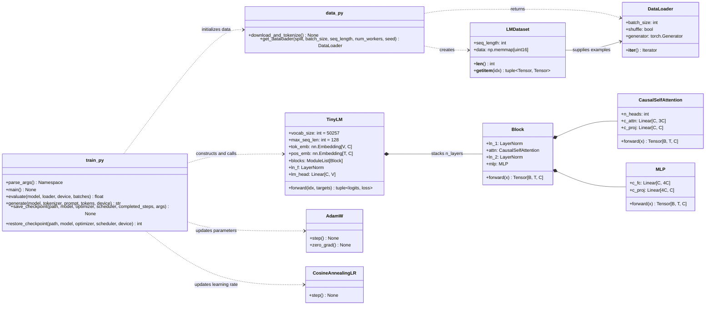

# Stage 1 architecture

This diagram describes the current relationship between `data.py`, `model.py`,
and `train.py`. Shapes in square brackets are tensor shapes; `V` is the
tokenizer vocabulary size (`50,257` for GPT-2 BPE).



## One training step

```mermaid
sequenceDiagram
    participant Train as train.py / main()
    participant Loader as DataLoader
    participant Dataset as LMDataset
    participant Model as TinyLM
    participant Opt as AdamW + Scheduler
    participant Disk as metrics.jsonl + checkpoint

    Train->>Loader: next(train_iterator)
    Loader->>Dataset: __getitem__(idx), repeated B times
    Dataset-->>Loader: x, y per example [T], [T]
    Loader-->>Train: input_tokens, target_tokens [B, T] = [32, 128]
    Train->>Model: forward(inputs, targets)
    Model->>Model: tok_emb(inputs) [B, T, C]
    Model->>Model: add pos_emb [T, C]
    Model->>Model: n Transformer Blocks with causal attention
    Model->>Model: lm_head → logits [B, T, V]
    Model-->>Train: logits [32, 128, 50257], cross-entropy loss scalar
    Train->>Model: loss.backward()
    Train->>Opt: clip gradients, optimizer.step(), scheduler.step()
    Train->>Disk: append metrics; periodically save complete state
```

## Value legend

| Symbol | Meaning | Stage 1 default |
|---|---|---:|
| `B` | batch size: examples processed per optimizer update | 32 |
| `T` | sequence length: token positions per example | 128 |
| `V` | GPT-2 BPE vocabulary size | 50,257 |
| `C` | learned token-vector / model dimension | 192 |

`target_tokens` holds an integer token ID at each `[B, T]` position. The model
creates one `V`-length logit vector for each position, then cross-entropy
compares it to that single correct target ID.
